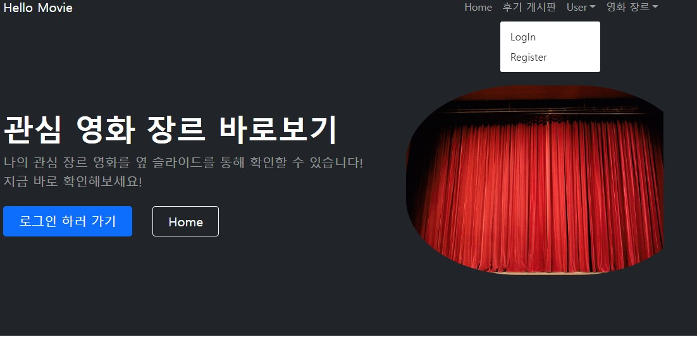

#K-Digital-Web 프로젝트 
**참여 조** 
2조 
**참여자 명** 
심상진 
**제작 목적**
영화 소개 및 평점 부여 사이트 제작

- **부트스트랩 템플릿**
https://startbootstrap.com/previews/modern-business  
- **Django 환경 셋팅**
https://goni99developer.tistory.com/3  
- **Django 웹 생성**
https://goni99developer.tistory.com/4  
- **Django ORM 적용**
https://goni99developer.tistory.com/5  
- **PythonAnywhere 적용**
https://goni99developer.tistory.com/6  

**맡은 업무** 
웹 페이지의 로그인 부분을 구현 
우선 페이지 네비게이션 버튼 중 하나를 드롭당누 메뉴로 만든 뒤 
로그인 여부에 따라 로그인/회원가입 혹은 사용자ID/로그아웃 버튼을 만든다. 

